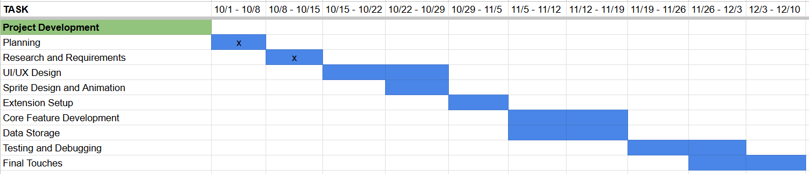

Team name: The Computer Guys 2

Team members: Ryan Strait, Ian Duthler, Jayden McWhirter, Enrique Jayes

# Introduction

An academic chrome extension that features a small animated sprite. This tamagotchi-inspired extension will leverage the user's ability to stay consistent through their different classes. The more consistent the user is, shown through their completion of assignments, the longer the sprite will live and grow. The sprite is also subject to negative effects if the user's actions are inconsistent.
The goal for the extension is to promote consistency within the user's academic career. It will allow the user to set a goal for themselves, and any work past the goal will reward the user with cosmetics for their sprite.

# Anticipated Technologies

We are going to be making a Chrome extension, which will require us to work with HTML, CSS, and JavaScript. 
* HTML will be required for the structure. 
* CSS will be required for styling.
* JavaScript will be required for the logic and functionality.

# Method/Approach

Our plan for this project is to create a mock-up of the project that we all feel sufficient with, and to make sure that throughout the coding process, this template is kept in mind. When we get closer to having a finished project, ideally we would like to have users test it so that we can get feedback on how we can make it better.
We chose the Agile Scrum process model because it would allow us to complete portions of the project and reflect upon them with each other before continuing with the next steps. We think this would be a good choice because it would allow each of us to work on the project on our own time and bring our work together during our meetings. I personally believe that this would help us the most during our project because we can proceed to the next step on our own times, without waiting for everyone to finish.

# Estimated Timeline

Our estimated timeline is in the form of the Gantt chart below:

# Anticipated Problems

The main problem that I see for our project is whether or not we will be able to get the API of Blackboard to work, as we are unsure if GVSU has some sort of lock on it, since private information is contained within it.
A smaller problem I could foresee happening is that we have set our scopes too high for the project. However, I am confident that our team can complete the project in time. 

Remember this is a living document is expected to be changed as you make progress on your project.
